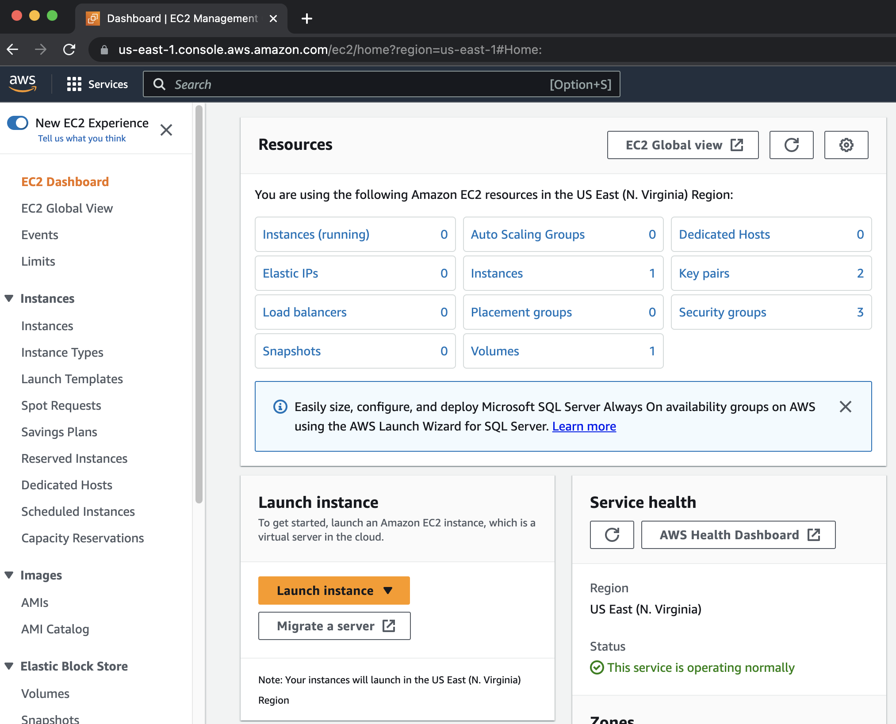
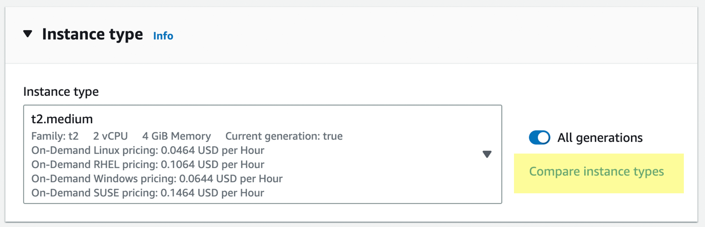
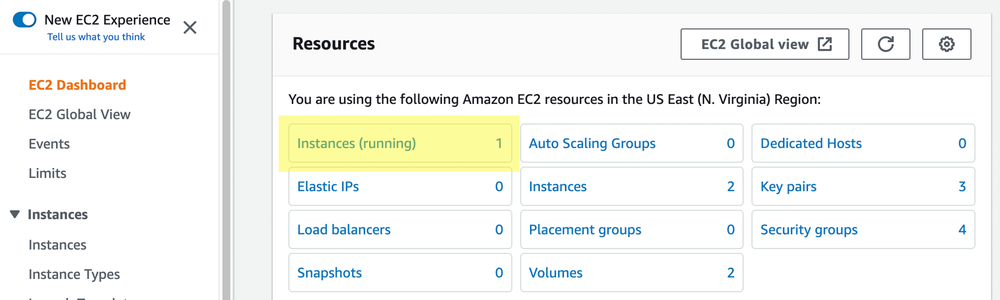
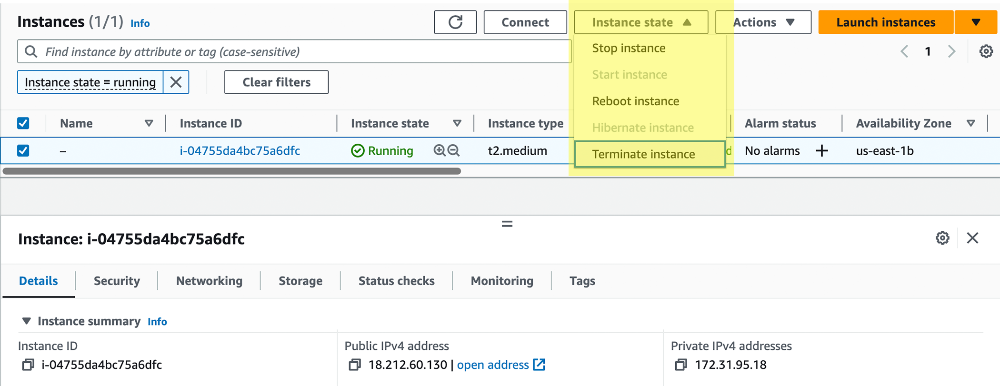

> ## Do I need to create my own instances?
> 
> **If you are:**
> 
> - teaching at or attending a centrally organized Data 
Carpentry workshop, 
> - a Maintainer for one of the Genomics lessons, or
> - contributing to the Genomics lessons,
> 
> The Carpentries staff will create AMI instances for you. Please contact
> team@carpentries.org. 
> 
> **If you are:**
> 
> - teaching at a self-organized workshop, 
> - working through these lessons on your own outside of a workshop, 
> - practicing your skills after a workshop, or
> - using these lessons for a teaching demonstration as part of your Instructor checkout for The Carpentries,
> 
> you will need to create your own AMI instances using the instructions below. The cost of using this AMI for a few days, with the 
> t2.medium instance type is very low (about USD $1.50 per day). Data Carpentry has no control over AWS pricing structure and provides 
> this cost estimate with no guarantees. Please read [AWS documentation on pricing](https://docs.aws.amazon.com/awsaccountbilling/latest/aboutv2/billing-getting-started.html) for up-to-date information.
{: .callout}

### Launching an instance on Amazon Web Services

> ## Prerequisites
> * Form of payment (credit card)  
> * Understanding of Amazon's billing and payment (See: [Getting started with AWS Billing and Cost Management](https://docs.aws.amazon.com/awsaccountbilling/latest/aboutv2/billing-getting-started.html))  
> * You can use some of Amazon Web Services for free, or see if you qualify for an AWS Grant (See: [https://aws.amazon.com/grants/](https://aws.amazon.com/grants/) ) if you are using AWS for education. The free level of service *will not* be sufficient for working with the amount of data we are using for our lessons.  
{: .prereq}

#### Create an AWS account

1. Go to Amazon Web Services [https://aws.amazon.com/](https://aws.amazon.com/)
2. Follow the button to sign up for an account - you will need to agree to Amazon's terms and conditions and provide credit card information.

#### Sign into AWS and Launch an Instance
1. Sign into the AWS EC2 Dashboard: [https://console.aws.amazon.com/ec2/](https://console.aws.amazon.com/ec2/)

2. Click the 'Launch Instance' button  



3. In 'Step 1' you will be asked to choose an Amazon Machine Image (AMI), on the lefthand side, look for 'Community AMIs' and then search for the AMI listed on this curriculum's [Setup page](https://datacarpentry.org/genomics-workshop/setup.html); select that image  


4. For 'Choose and Instance Type' select **t2.medium**; then click 'Review and Launch'  

  

5. Click on "6. Configure Security Group" in the top navigation menu. Choose
"select an existing security group" under "assign a security group", and
choose "sg-a5dba9ef" which has the name "to use with DC genomics AMI".

6. For the 'Review Instance Launch' step, click 'Launch'

7. You will be asked to select an existing key pair or create a new key pair. Select 'Proceed without a key pair' and select the acknowledgement you are given. Then click 'Launch Instances'  


You instance will now be launched. You should follow the links to 'Create billing alerts' and then the instructions below
for connecting to and terminating your Amazon Instance.

> ## Connect to your Amazon Instance (Mac OS X)
> 
> 1. Log into your AWC EC2 Dashboard [https://console.aws.amazon.com/ec2/](https://console.aws.amazon.com/ec2/)
> 
> 2. You should see that you have one instance. To proceed, the instance state must be 'running' (if you just launched the instance it will take <5 min for the instance to start running).
> 
> 
> 
> 3. At the bottom of the dashboard, you should see a **Public DNS** which will look something like *ec2.12.2.45.678.compute-1.amazonaws.com*. Copy that address (you may wish make a note of it as you will need this each time you connect.)  
> 
> 
> 
> 4. Open the terminal application on your Mac and use 'ssh' to connect. Your command will be something like:
> 
> ```bash
> $ ssh dcuser@ec2.12.2.45.678.compute-1.amazonaws.com
> ```
> 
> Be sure to replace `ec2.12.2.45.678.compute-1.amazonaws.com` above with the DNS for your image.
> 
> 5. Your computer will be unable to verify the authenticity of the host; type **yes** to continue connecting
> 
> 6. Then enter the password for this computer. 
> 
> You should now be connected to your personal instance. You can confirm this with the following commands; ``whoami`` and ``pwd``, which should yield the following results:
> 
> ```bash
> Last login: Thu Jul 30 13:21:08 2015 from 8.sub-70-197-200.myvzw.com
> $ whoami
> dcuser
> $ pwd
> /home/dcuser
> ```
{: .solution}

> ## Connect to your Amazon instance (Windows)
> 
> 1. Download the PuTTY application at: [http://the.earth.li/~sgtatham/putty/latest/x86/putty.exe](http://the.earth.li/~sgtatham/putty/latest/x86/putty.exe)
> 
> 2. Log into your AWC EC2 Dashboard [https://console.aws.amazon.com/ec2/](https://console.aws.amazon.com/ec2/)
> 
> 3. You should see that you have one instance, make sure instance state is 'running' (if you just launched the instance it will take <5 min for the instance to start running)  
>
> 
> 
> 4. At the bottom of the dashboard, you should see a **Public DNS** which will look something like *ec2.12.2.45.678.compute-1.amazonaws.com*. Copy that address (you may wish make a note of it as you will need this each time you connect.)  
> 
> 
> 
> 5. Start PuTTY. In the section 'Specify the destination you want to connect to' for 'Host Name (or IP address)' paste in the DNS address and click 'Open'
> 
> 6. When prompted to login as, enter 'dcuser'; you may be notified that the authenticity of the host cannot be verified - if so, ignore the warning an continue connecting
> 
> 7. When prompted, enter your password.
> 
> You should now be connected to your personal instance. You can confirm this with the following commands; ``whoami`` and ``pwd``, which should yield the following results:
> 
> ```bash
> Last login: Thu Jul 30 13:21:08 2015 from 8.sub-70-197-200.myvzw.com
> $ whoami
> dcuser
> $ pwd
> /home/dcuser
> ```
{: .solution}

#### Terminating your instance

> ## Very Important Warning - Avoid Unwanted Charges
> Please remember, for as long as this instance is running, you will
> be charged for your usage. You can see an estimate of the current 
> charge from your AWS EC2 dashboard by clicking your name (Account 
> name) on the upper right of the dashboard and selecting 'Billing
> & Cost Management'. **DO NOT FORGET TO TERMINATE YOUR INSTANCE WHEN YOU ARE DONE**
{: .callout}

When you are finished with your instance, you must terminate it to avoid unwanted charges. Follow the following steps.

1. Sign into AWS and go to the EC2 Dashboard: [https://console.aws.amazon.com/ec2/](https://console.aws.amazon.com/ec2/)
2. Under 'Resources' select 'Running Instances'
3. Select the instance you wish to terminate, then click 'Actions'  



4. Under 'Instance State' select terminate.

> ## Warning
> Terminating an instance will delete any data on this instance, so you must move any data you wish to save off the instance.
{: .callout}

5. Select 'Yes, Terminate' to terminate the instance.
